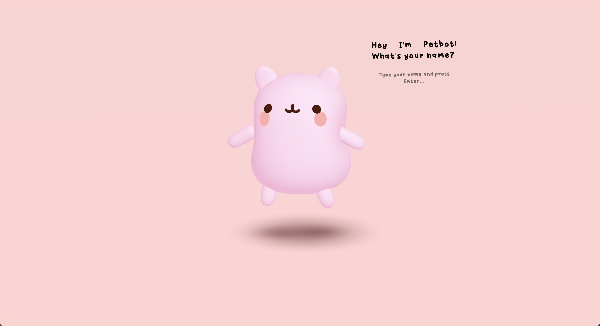
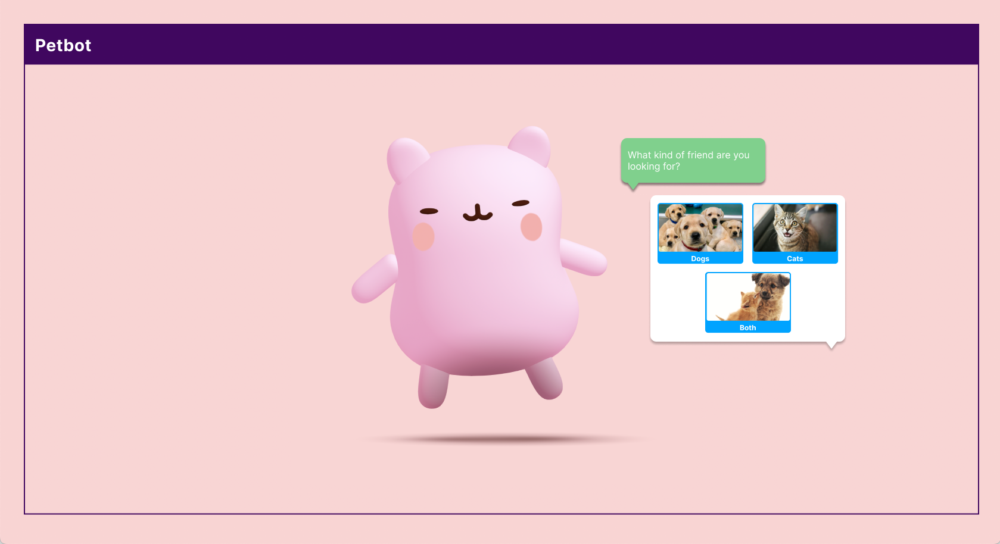
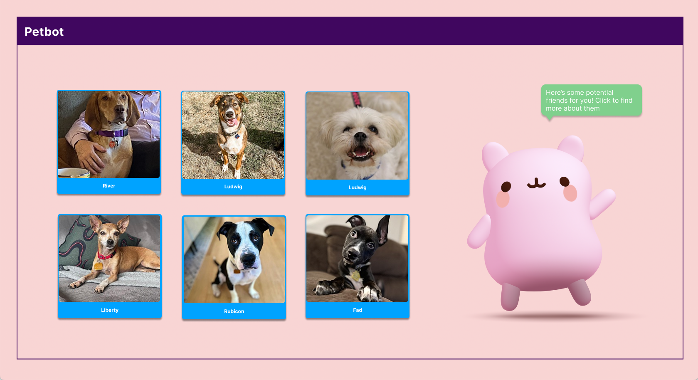

# Petbot

A project for Connections Lab (Fall '22) at NYU Tisch IMA Low Res. 

## Key concept(s) and/or intention(s) driving the project. Include any noteworthy inspirations or influences

There are multiple intentions of this project, which include:

1. Creating a 3D interface: Typically, 3D graphics has been used for either for video games, or for pure decoration. For this project, I wanted to experiment with the idea of creating a 3D interface that was somewhere in between the two typical use cases. I wanted to brainstorm a possible use case of how 3D could be used in the web as the next evolution of UI. 
2. Characterize a chat bot: I wanted to make talking to chat bots a little more personal by adding an animated character to it and make them feel more tangible.  
3. Learn & Practice 3D modeling and ThreeJS: I have taken some online courses for ThreeJS but have not applied the skills to any projects yet. I wanted to get more practice with it and explore how they can be interactive. 

## Production decisions (i.e. technical, design, creative, etc.)
### Technical decisions

To build the initial 3D model of Petbot, I used Spline, which is a newer 3D modeling tool that has code exports. The application is built using React, ThreeJS, and React Three Fiber. To create the animations, I used mostly TheatreJS, which is a library commonly used to create animation sequences for ThreeJS objects. 

### Design decisions

Initial Figma designs

I enabled the Orbit Controls included in ThreeJs to allow users to drag the camera's point of view around to showcase the 3D visuals. Initially, I had designed the text and buttons to be flat elements on the screen, but ultimately I decided that 3D text would make it feel more immersive. The decision to list the available pets as cubes was also to create a more unique experience.

### Creative decisions

When interacting with Petbot, I wanted user to feel excited and happy, since the idea is around pets. Inherently, I think that 3D visuals already creates an atmosphere of playfulness, and I chose the pink color scheme and font style to further encourage the fun atmosphere.

## Major challenges and solutions (i.e. the most difficult aspects of the project for you and how you attempted to address them)

Some major challenges began at a technical level. I used Spline to create the initial Petbot model, but it was only exportable to a React Three Fiber component. Setting up a R3F app was challenging, as there was limited documentation and issues with certain versions of NodeJS. Exporting the models as code was also buggy, and required a lot manual updating in the component. The next major challenge was animating the character. I used TheatreJS which is a javascript animation library with a professional motion design toolset. While there was documentation to hook up TheatreJS to R3F, there was a lot of assumptions that needed to be made when making objects editable with the toolset. However, after setup of the components with the tools, creating the actual experience was much easier.

## Lessons learned as well as potential next steps if work on the project continues

A lesson learned during this project is that ThreeJS is powerful, but the tools around it are still limiting and buggy. Another lesson is learning the differences between 2D and 3D experiences on the web. It was interesting to apply the flat UI elements were are accustomed to on websites, and apply it in a 3D space. If I were to continue on this project, I would like to create a longer conversation between Petbot and the user before showing the list of pets. This way, it would create a more personal relationship for the user. I would also like to add more drag and drop functionality to create more fun and immersive interactions. 

## Any relevant references/resources

Spline (https://spline.design/)

React Three Fiber (https://docs.pmnd.rs/)

TheatreJS (https://www.theatrejs.com/)

Adopt-a-pet API (https://www.adoptapet.com/public/apis/pet_list.html) 

## Link to the project (Github Pages)

https://ddo-nyu.github.io/petbot-react-app/

## Link to the project code (GitHub repo)

https://github.com/ddo-nyu/petbot-react-app